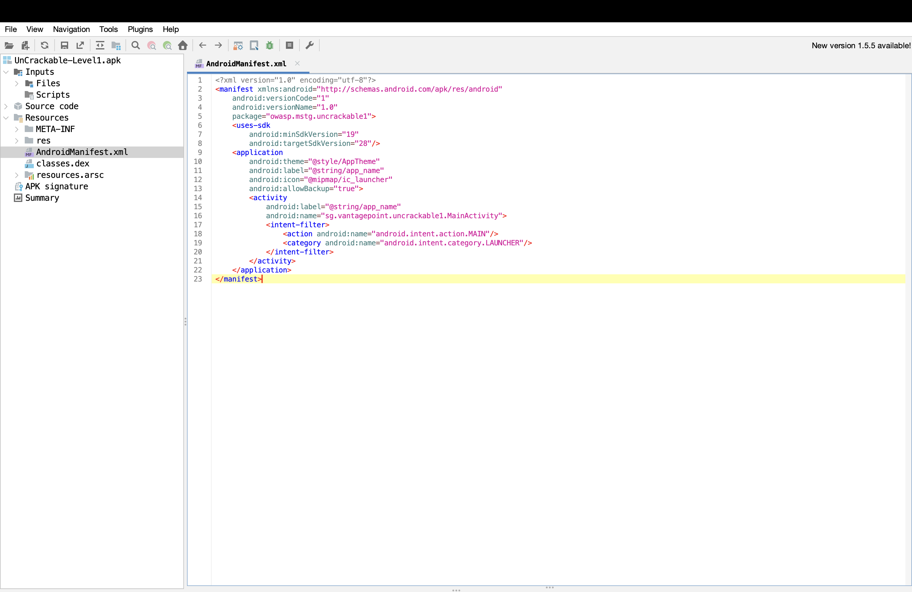
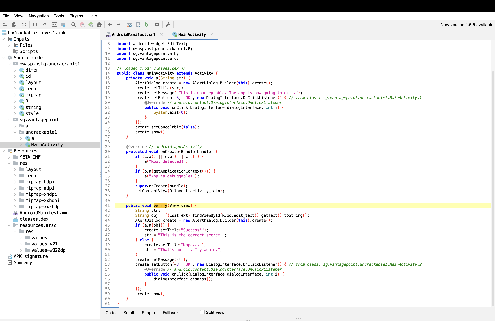
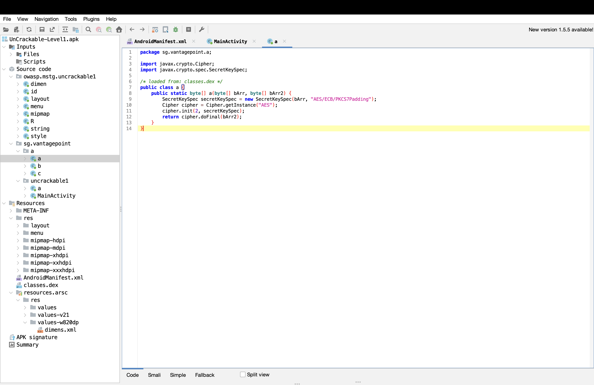
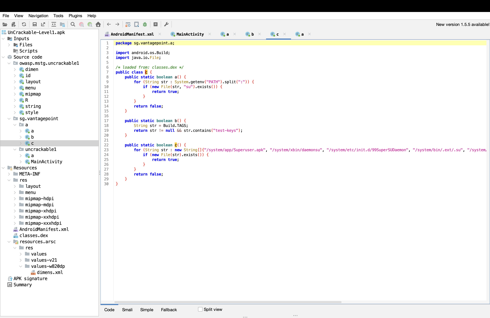
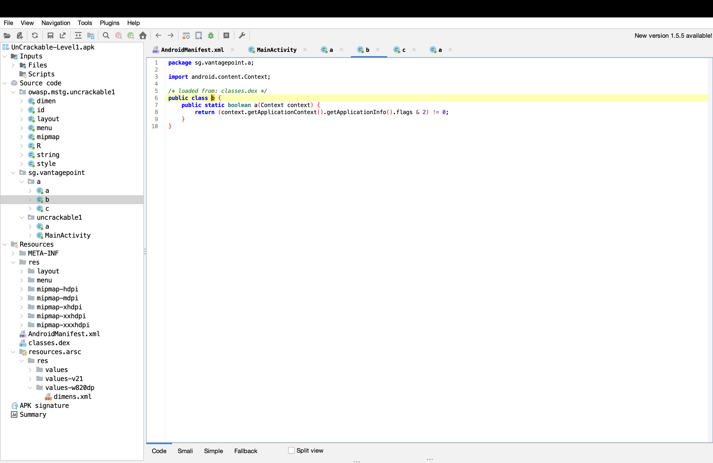
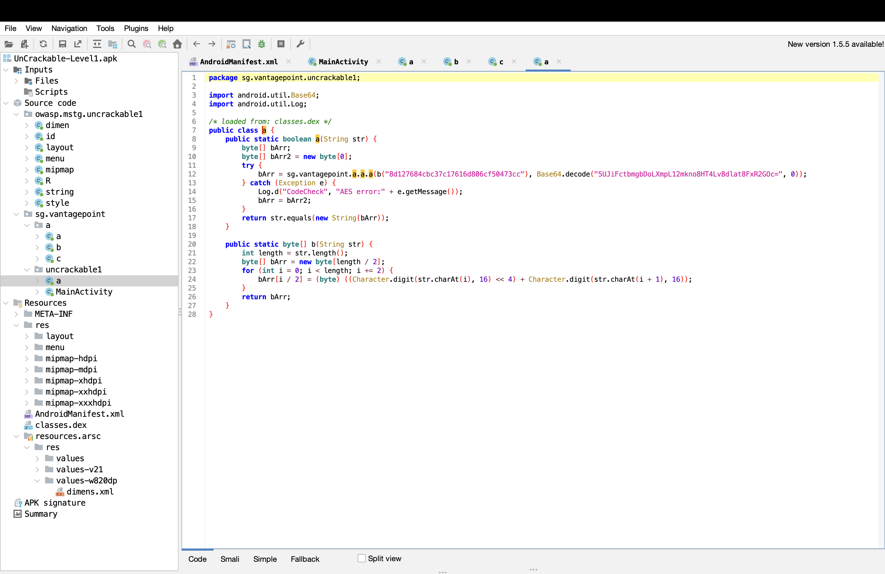
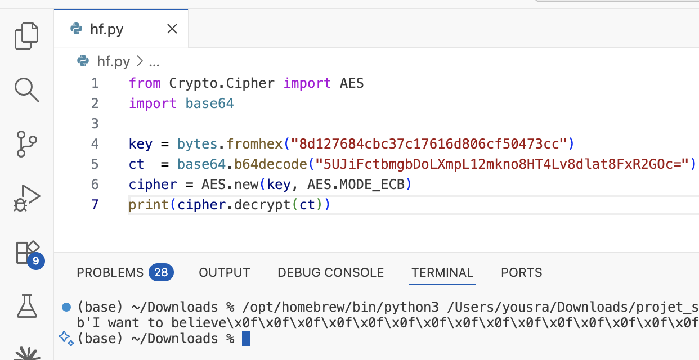

# Analyse Statique APK — OWASP UnCrackable Level 1

> **Lab pédagogique** — Analyse statique d'un APK Android à l'aide de JADX GUI.  
> APK source : [OWASP MASTG Crackmes](https://mas.owasp.org/crackmes/Android/)  
> Outil principal : JADX GUI v1.5.0

---

## Table des matières

1. [Objectif](#objectif)
2. [Environnement & outils](#environnement--outils)
3. [Étape 1 — Préparation du workspace](#étape-1--préparation-du-workspace)
4. [Étape 2 — Analyse du manifest](#étape-2--analyse-du-manifest)
5. [Étape 3 — Analyse de MainActivity](#étape-3--analyse-de-mainactivity)
6. [Étape 4 — Moteur cryptographique (sg.vantagepoint.a.a)](#étape-4--moteur-cryptographique-sgvantagepointa)
7. [Étape 5 — Détection de root (sg.vantagepoint.a.c)](#étape-5--détection-de-root-sgvantagepointac)
8. [Étape 6 — Détection de debug (sg.vantagepoint.a.b)](#étape-6--détection-de-debug-sgvantagepointab)
9. [Étape 7 — Secret hardcodé (sg.vantagepoint.uncrackable1.a)](#étape-7--secret-hardcodé-sgvantagepointuncrackable1a)
10. [Étape 8 — Exploitation offline](#étape-8--exploitation-offline)
11. [Constats de sécurité](#constats-de-sécurité)
12. [Remédiations](#remédiations)

---

## Objectif

Démontrer qu'une application Android mal conçue peut être entièrement compromise par **analyse statique seule** — sans exécuter l'application, sans appareil physique, sans émulateur.

À la fin de ce lab, le secret de l'application (`I want to believe`) est récupéré uniquement par décompilation et déchiffrement offline.

---

## Environnement & outils

| Outil | Version | Usage |
|---|---|---|
| JADX GUI | 1.5.0 | Décompilation APK, lecture manifest |
| Python 3 + pycryptodome | — | Déchiffrement AES offline |
| macOS / Linux terminal | — | Préparation workspace |

---

## Étape 1 — Préparation du workspace

```bash
# Créer le dossier de travail
mkdir ~/APK-Analysis
cd ~/APK-Analysis

# Télécharger l'APK (macOS)
curl -L -o UnCrackable-Level1.apk \
  https://github.com/OWASP/owasp-mastg/raw/master/Crackmes/Android/Level_01/UnCrackable-Level1.apk

# Vérifier que c'est un ZIP valide (doit commencer par "PK" = 50 4B)
hexdump -n 4 UnCrackable-Level1.apk

# Hash SHA256 pour traçabilité
sha256sum UnCrackable-Level1.apk

# Lister le contenu
unzip -l UnCrackable-Level1.apk | head -20
```

**Structure interne de l'APK :**
```
AndroidManifest.xml   ← permissions, composants, configuration
classes.dex           ← bytecode Dalvik compilé
res/                  ← ressources (layouts, strings, images)
resources.arsc        ← ressources compilées
META-INF/             ← signature de l'APK
```

---

## Étape 2 — Analyse du manifest

**Lancer JADX GUI → File → Open file → sélectionner l'APK**  
Naviguer vers : `Resources → AndroidManifest.xml`



### Ce que le manifest révèle

```xml
<manifest package="owasp.mstg.uncrackable1"
    android:versionCode="1"
    android:versionName="1.0">

    <uses-sdk
        android:minSdkVersion="19"
        android:targetSdkVersion="28"/>

    <application
        android:allowBackup="true">       <!-- ⚠️ Constat #4 -->

        <activity
            android:name="sg.vantagepoint.uncrackable1.MainActivity">
            <intent-filter>               <!-- ⚠️ Composant exporté implicitement -->
                <action android:name="android.intent.action.MAIN"/>
                <category android:name="android.intent.category.LAUNCHER"/>
            </intent-filter>
        </activity>
    </application>
</manifest>
```

| Champ | Valeur | Observation |
|---|---|---|
| Package | `owasp.mstg.uncrackable1` | — |
| Version | 1.0 | — |
| minSdkVersion | **19** (Android 4.4) | ⚠️ Android obsolète |
| targetSdkVersion | 28 | — |
| `android:debuggable` | **absent** (= false) | ✅ Correct |
| `android:allowBackup` | **true** | ⚠️ Risque extraction données |
| Permissions | **aucune** | ✅ Surface minimale |
| Activité exportée | `MainActivity` via intent-filter | ⚠️ exported non déclaré explicitement |

---

## Étape 3 — Analyse de MainActivity

Naviguer vers : `Source code → sg.vantagepoint.uncrackable1 → MainActivity`



### onCreate() — vérifications de sécurité au démarrage

```java
protected void onCreate(Bundle bundle) {
    // Vérifie si l'appareil est rooté (3 méthodes)
    if (c.a() || c.b() || c.c()) {
        a("Root detected!");
    }
    // Vérifie si l'app tourne en mode debug
    if (b.a(getApplicationContext())) {
        a("App is debuggable!");
    }
    super.onCreate(bundle);
    setContentView(R.layout.activity_main);
}
```

L'application tente de se défendre contre root et debug — mais ces défenses sont **visibles dans le code** et donc bypassables.

### verify() — validation du secret utilisateur

```java
public void verify(View view) {
    String obj = ((EditText) findViewById(R.id.edit_text)).getText().toString();
    AlertDialog create = new AlertDialog.Builder(this).create();
    if (a.a(obj)) {              // <-- délègue à sg.vantagepoint.uncrackable1.a
        create.setTitle("Success!");
        str = "This is the correct secret.";
    } else {
        create.setTitle("Nope...");
        str = "That's not it. Try again.";
    }
}
```

La validation est entièrement **côté client** — la logique complète est dans l'APK.

---

## Étape 4 — Moteur cryptographique (sg.vantagepoint.a.a)

Naviguer vers : `Source code → sg.vantagepoint → a → a`



```java
public class a {
    public static byte[] a(byte[] bArr, byte[] bArr2) {
        SecretKeySpec secretKeySpec = new SecretKeySpec(bArr, "AES/ECB/PKCS7Padding");
        Cipher cipher = Cipher.getInstance("AES");
        cipher.init(2, secretKeySpec);        // mode 2 = DECRYPT
        return cipher.doFinal(bArr2);
    }
}
```

**Problèmes identifiés :**
- Mode **AES/ECB** — le mode le plus faible, déterministe, sans IV
- Fonction de déchiffrement pure : prend clé + ciphertext → retourne plaintext
- Tout ce dont on a besoin est la clé et le ciphertext, tous deux hardcodés ailleurs

---

## Étape 5 — Détection de root (sg.vantagepoint.a.c)

Naviguer vers : `Source code → sg.vantagepoint → a → c`



```java
public class c {

    // Méthode a() — cherche le binaire "su" dans le PATH
    public static boolean a() {
        for (String str : System.getenv("PATH").split(":")) {
            if (new File(str, "su").exists()) return true;
        }
        return false;
    }

    // Méthode b() — vérifie les build tags (test-keys = ROM non officielle)
    public static boolean b() {
        String str = Build.TAGS;
        return str != null && str.contains("test-keys");
    }

    // Méthode c() — cherche des fichiers système liés au root
    public static boolean c() {
        for (String str : new String[]{
            "/system/app/Superuser.apk",
            "/system/xbin/daemonsu",
            "/system/etc/init.d/99SuperSUDaemon",
            "/system/bin/.ext/.su", ...}) {
            if (new File(str).exists()) return true;
        }
        return false;
    }
}
```

**Pourquoi c'est bypassable :** Les trois chemins de détection sont visibles en clair. Un attaquant peut patcher l'APK pour forcer ces méthodes à retourner `false`, ou hooker les appels avec Frida à l'exécution.

---

## Étape 6 — Détection de debug (sg.vantagepoint.a.b)

Naviguer vers : `Source code → sg.vantagepoint → a → b`



```java
public class b {
    public static boolean a(Context context) {
        return (context.getApplicationContext().getApplicationInfo().flags & 2) != 0;
    }
}
```

Le flag `2` correspond à `FLAG_DEBUGGABLE`. Cette vérification runtime détecte si l'app est lancée en mode debug — mais elle est elle-même hookable via Frida (`return false` forcé).

---

## Étape 7 — Secret hardcodé (sg.vantagepoint.uncrackable1.a)

Naviguer vers : `Source code → sg.vantagepoint → uncrackable1 → a`



```java
public class a {
    public static boolean a(String str) {
        byte[] bArr;
        byte[] bArr2 = new byte[0];
        try {
            bArr = sg.vantagepoint.a.a.a(
                b("8d127684cbc37c17616d806cf50473cc"),            // clé AES (hex)
                Base64.decode("5UJiFctbmgbDoLXmpL12mkno8HT4Lv8dlat8FxR2GOc=", 0)  // ciphertext
            );
        } catch (Exception e) {
            Log.d("CodeCheck", "AES error:" + e.getMessage());   // ⚠️ log de debug
            bArr = bArr2;
        }
        return str.equals(new String(bArr));
    }
}
```

**C'est le constat le plus critique :**
- Clé AES-128 hardcodée en hexadécimal : `8d127684cbc37c17616d806cf50473cc`
- Ciphertext hardcodé en Base64 : `5UJiFctbmgbDoLXmpL12mkno8HT4Lv8dlat8FxR2GOc=`
- Les deux valeurs sont lisibles directement après décompilation
- Un log de debug (`Log.d`) expose les erreurs AES internes

---

## Étape 8 — Exploitation offline

Avec la clé et le ciphertext extraits du code, le secret est récupéré en 7 lignes de Python — **sans jamais exécuter l'application**.



```python
from Crypto.Cipher import AES
import base64

key = bytes.fromhex("8d127684cbc37c17616d806cf50473cc")
ct  = base64.b64decode("5UJiFctbmgbDoLXmpL12mkno8HT4Lv8dlat8FxR2GOc=")
cipher = AES.new(key, AES.MODE_ECB)
print(cipher.decrypt(ct))
# Output: b'I want to believe\x0f\x0f\x0f...'
```

**Résultat : `I want to believe`**  
Les octets `\x0f` sont du padding PKCS7 (valeur 15 = 15 octets de padding) — ignorés.

---

## Constats de sécurité

### Constat #1 — Clé AES et ciphertext hardcodés dans l'APK
| | |
|---|---|
| **Sévérité** | 🔴 Élevée |
| **Localisation** | `sg.vantagepoint.uncrackable1.a`, ligne 12 |
| **Description** | La clé de chiffrement AES-128 et le ciphertext sont tous deux embarqués en dur dans le bytecode de l'application. Toute personne décompilant l'APK peut les lire directement. |
| **Impact** | Le secret de l'application est récupérable par n'importe quel analyste en moins de 5 minutes, sans exécuter l'app. Démontré ci-dessus. |
| **Remédiation** | Ne jamais stocker de secrets dans l'APK. Déléguer la validation à un backend. Si un secret local est nécessaire, utiliser Android Keystore avec dérivation de clé (PBKDF2/Argon2). |

---

### Constat #2 — AES/ECB : mode cryptographique faible
| | |
|---|---|
| **Sévérité** | 🔴 Élevée |
| **Localisation** | `sg.vantagepoint.a.a`, ligne 9 |
| **Description** | L'algorithme AES est utilisé en mode ECB (Electronic Codebook). Ce mode est déterministe : un même plaintext produit toujours le même ciphertext. Il ne protège pas les patterns dans les données et est considéré cryptographiquement cassé pour tout usage réel. |
| **Impact** | Même si la clé n'était pas hardcodée, ECB facilite les attaques par plaintext connu et par analyse de patterns. |
| **Remédiation** | Utiliser `AES/GCM/NoPadding` avec un IV aléatoire par opération. GCM fournit à la fois confidentialité et authenticité (AEAD). |

---

### Constat #3 — Détection de root bypassable statiquement
| | |
|---|---|
| **Sévérité** | 🟠 Moyenne |
| **Localisation** | `sg.vantagepoint.a.c` — méthodes `a()`, `b()`, `c()` |
| **Description** | Les trois méthodes de détection de root (présence du binaire `su`, build tags `test-keys`, fichiers système SuperSU) sont entièrement visibles dans le code décompilé. |
| **Impact** | Un attaquant peut : (1) patcher l'APK pour forcer ces méthodes à retourner `false`, ou (2) hooker les appels à l'exécution via Frida en une ligne. |
| **Remédiation** | Remplacer les checks maison par **Google Play Integrity API** (anciennement SafetyNet). Ajouter une vérification d'intégrité côté serveur. Accepter que la détection de root ne soit jamais parfaite côté client. |

---

### Constat #4 — `android:allowBackup="true"`
| | |
|---|---|
| **Sévérité** | 🟠 Moyenne |
| **Localisation** | `AndroidManifest.xml`, attribut de `<application>` |
| **Description** | L'attribut `allowBackup="true"` permet à ADB d'extraire les données privées de l'application (`adb backup`) sans nécessiter de root sur l'appareil. |
| **Impact** | Sur un appareil avec débogage USB activé, un attaquant avec accès physique peut extraire SharedPreferences, bases de données SQLite et fichiers internes. |
| **Remédiation** | Définir `android:allowBackup="false"` dans le manifest, sauf besoin fonctionnel justifié. |

---

### Constat #5 — Log de debug exposant des erreurs internes
| | |
|---|---|
| **Sévérité** | 🟡 Faible |
| **Localisation** | `sg.vantagepoint.uncrackable1.a`, ligne 14 |
| **Description** | `Log.d("CodeCheck", "AES error:" + e.getMessage())` expose les messages d'erreur du moteur AES dans les logs système, accessibles via `adb logcat`. |
| **Impact** | Facilite le diagnostic pour un attaquant, révèle des détails sur l'implémentation cryptographique interne. |
| **Remédiation** | Supprimer tous les `Log.d/e/v` en build release. Utiliser ProGuard/R8 avec des règles de suppression des logs. |

---

## Remédiations

### Priorité haute
1. **Supprimer toute logique de validation côté client** — déplacer la vérification du secret vers un endpoint backend authentifié
2. **Remplacer AES/ECB par AES/GCM** avec IV aléatoire par opération

### Priorité moyenne
3. **`android:allowBackup="false"`** dans le manifest
4. **Remplacer les checks root maison** par Google Play Integrity API

### Priorité faible
5. **Supprimer les logs de debug** en production (règles ProGuard)
6. **Relever `minSdkVersion`** à 26+ pour bénéficier des protections Android modernes

---

## Résumé de l'attaque

```
APK décompilé avec JADX
        ↓
AndroidManifest.xml → allowBackup=true, minSdk=19
        ↓
MainActivity.verify() → délègue à sg.vantagepoint.uncrackable1.a
        ↓
uncrackable1.a → clé AES + ciphertext hardcodés lisibles
        ↓
sg.vantagepoint.a.a → moteur AES/ECB
        ↓
Python (7 lignes) → déchiffrement offline
        ↓
Secret : "I want to believe"
```

**Temps total : < 15 minutes. Aucune exécution requise.**

---

*Lab réalisé dans un cadre strictement pédagogique sur un APK OWASP conçu à cet effet.*
